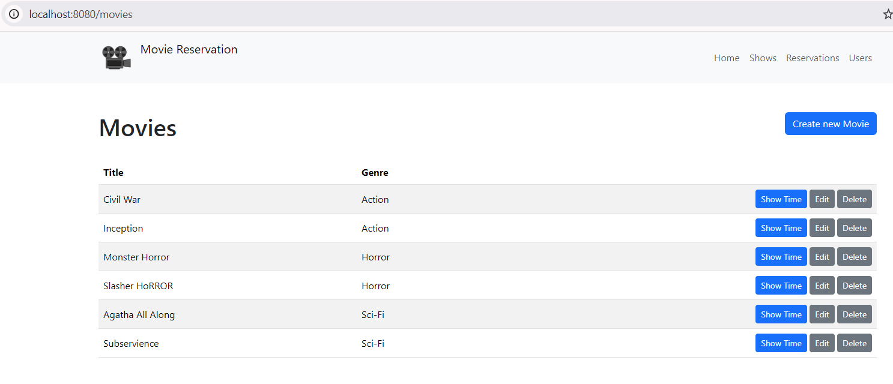
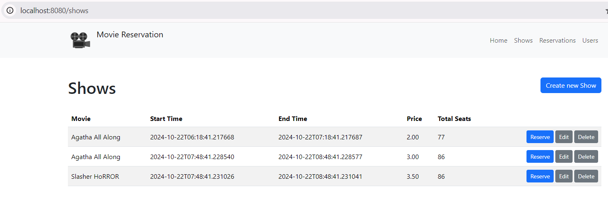
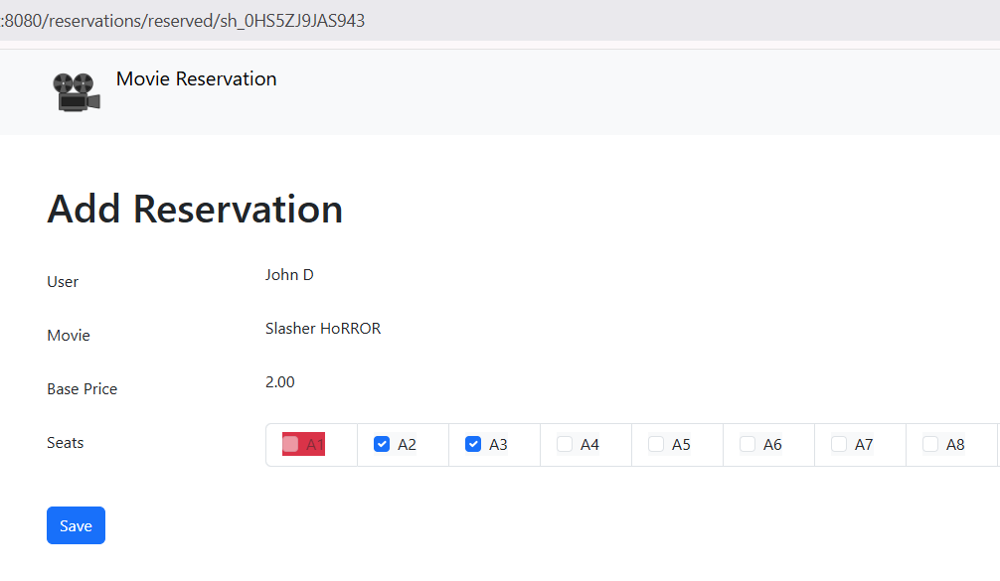
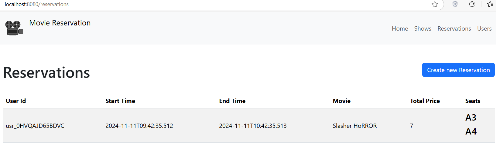

Build a Movie Reservation Website with Spring Boot: A Beginner's Guide
===


Hey there, fellow developers! 👋 Ever wondered how websites like MovieTickets work behind the scenes? Today, we're going to build our own movie reservation website using Spring Boot. Don't worry if you're just starting out, I'll break everything down into simple, easy-to-follow steps.

## What's Spring Boot and Why Are We Using It?

Think of Spring Boot as your trusty assistant that helps you build websites faster and easier. It's like having a super-helpful friend who has already set up most of the boring stuff for you so that you can focus on the fun parts of coding!
Imagine you're building a house. Instead of creating every tool from scratch, Spring Boot gives you a ready-to-use toolbox. It handles a lot of the complex setup that usually gives developers headaches, like:

* Setting up a new project (it's as easy as clicking a few buttons!)
* Managing different parts of your website
* Connecting to your database
* Making your website secure

The best part? Spring Boot is popular in the real world, so learning it now will help you in your future career. Plus, it's perfect for building websites that need to handle lots of users at once - exactly what we need for our movie reservation system!

## What We'll Build Together:

* A website where users can view movies and show times.
* A way to select seats and make reservations for showtimes.
* Allows admins to manage movies.
* The system should prioritize availability for viewing movies and shows but should prioritize consistency for reservations.

Ready to dive in? Let's start building something awesome! 🚀

### Getting Started 🎬

To follow along, you'll need:

* Basic Java knowledge
* A code editor (like IntelliJ or VS Code)
* Java Development Kit (JDK) installed

### Create a Spring Boot Project

Navigate to [start.spring.io](https://start.spring.io/). This service pulls in all the dependencies you need for an application and does most of the setup. Click generate, it will generate the Spring Boot project and download it as a zip. Now unzip this project and import it into any IDE.<br>

To interact with GridDB, we need to add a GridDB Java Client to this project. Add the following dependency into maven `pom.xml`.

```xml
<dependency>
  <groupId>com.github.griddb</groupId>
  <artifactId>gridstore</artifactId>
  <version>5.5.0</version>
</dependency>
```

### Defining the Entities

Let's start by looking at the big picture - kind of like sketching out the blueprint before building a house. Think of this like making a list of the main "things" our app needs to keep track of. In coding, we call these "entities" (but really, they're just the important pieces of data we need to store).

First, let's list out the key items we need for our app to work properly. We'll need the following entities:

* Movie: This entity stores essential information about a movie, for example, title and genre.

* Show: contains information related to the schedule or actual time at which a movie begins.

* Seat: represents the physical seat location.
* User: represents the individual interacting with the system.
* Reservation: records the details of a user's reservation. It typically includes the user ID, show ID, total price, reservation status, and seat number.

Next, let's create Java POJO classes.

<p>

```java
@Data
public class User {
    @RowKey
    String id;
    String email;
    String fullName;
    Date createdAt;
}

@Data
public class Movie {
    @RowKey
    private String id;
    private String title;
    private String genre;
}

@Data
public class Show {
    @RowKey
    private String id;
    private String movieId;
    private Date startTime;
    private Date endTime;
    private Double price;
    private Integer totalSeats;
}

@Data
public class Seat {
    @RowKey
    private String id;
    private String status;
    private String showId;
    private String seatNumber;
}

@Data
public class Reservation {
    @RowKey
    private String id;
    private String userId;
    private String showId;
    private Double totalPrice;
    private Integer numberOfSeats;
    private String[] seats;
    Date createdAt;
}

```
<br>

Next, we create the `GridDBConfig` class as a central configuration for database operation.
The class will do the following:
* Read environment variables for connecting to the GridDB database
* Create a GridStore class for managing database connection to the GridDB instance
* Create GridDB Collection's container (Table) to manage a set of rows. The container is a rough equivalent of the table in a relational database.
* On creating/updating the Collection we specify the name and object corresponding to the column layout of the collection.
  Also for each collection, we add an index for a column that is frequently searched and used in the condition of the WHERE section of TQL.
* Make the container available in the Spring container
<br>

```java
@Configuration
public class GridDBConfig {

  @Value("${GRIDDB_NOTIFICATION_MEMBER}")
  private String notificationMember;

  @Value("${GRIDDB_CLUSTER_NAME}")
  private String clusterName;

  @Value("${GRIDDB_USER}")
  private String user;

  @Value("${GRIDDB_PASSWORD}")
  private String password;

  @Bean
  public GridStore gridStore() throws GSException {
    Properties properties = new Properties();
    properties.setProperty("notificationMember", notificationMember);
    properties.setProperty("clusterName", clusterName);
    properties.setProperty("user", user);
    properties.setProperty("password", password);
    GridStore store = GridStoreFactory.getInstance().getGridStore(properties);
    return store;
  }

  @Bean
  public Collection<String, User> userCollection(GridStore gridStore) throws GSException {
      Collection<String, User> collection =
              gridStore.putCollection(AppConstant.USERS_CONTAINER, User.class);
      collection.createIndex("email");
      return collection;
  }

  @Bean
  public Collection<String, Movie> movieCollection(GridStore gridStore) throws GSException {
      Collection<String, Movie> movieCollection =
              gridStore.putCollection(AppConstant.MOVIE_CONTAINER, Movie.class);
      movieCollection.createIndex("title");
      return movieCollection;
  }

  @Bean
  public Collection<String, Show> showCollection(GridStore gridStore) throws GSException {
      Collection<String, Show> showCollection =
              gridStore.putCollection(AppConstant.SHOW_CONTAINER, Show.class);
      showCollection.createIndex("movieId");
      return showCollection;
  }

  @Bean
  public Collection<String, Seat> seatCollection(GridStore gridStore) throws GSException {
      Collection<String, Seat> seatCollection =
              gridStore.putCollection(AppConstant.SEAT_CONTAINER, Seat.class);
      seatCollection.createIndex("showId");
      return seatCollection;
  }

  @Bean
  public Collection<String, Reservation> reservationCollection(GridStore gridStore)
          throws GSException {
      Collection<String, Reservation> reservationCollection =
              gridStore.putCollection(AppConstant.RESERVATION_CONTAINER, Reservation.class);
      reservationCollection.createIndex("userId");
      reservationCollection.createIndex("showId");
      return reservationCollection;
  }
}
```
<br>

### Listing and creating movies

Now, we create the service class `MovieService.java` in the `service` package and implement all the business logic in this class. This service class will interact with the database and return the result after converting it to the DTO class.

```java
private List<Movie> fetchAll() {
    List<Movie> movies = new ArrayList<>(0);
    try {
        String tql = "SELECT * FROM " + AppConstant.MOVIE_CONTAINER;
        Query<Movie> query = movieCollection.query(tql);
        RowSet<Movie> rowSet = query.fetch();
        while (rowSet.hasNext()) {
            Movie row = rowSet.next();
            movies.add(row);
        }
    } catch (GSException e) {
        log.error("Error fetch all movies", e);
    }
    return movies;
}

public List<MovieDTO> findAll() {
    final List<Movie> movies = fetchAll();
    return movies.stream().map(movie -> mapToDTO(movie, new MovieDTO())).toList();
}

public MovieDTO get(final String id) {
    try (Query<Movie> query =
            movieCollection.query("SELECT * WHERE id='" + id + "'", Movie.class)) {
        RowSet<Movie> rowSet = query.fetch();
        if (rowSet.hasNext()) {
            return mapToDTO(rowSet.next(), new MovieDTO());
        } else {
            throw new NotFoundException();
        }
    } catch (GSException e) {
        throw new AppErrorException();
    }
}

public String create(final MovieDTO movieDTO) {
    if (titleExists(movieDTO.getTitle())) {
        return "";
    }
    final Movie movie = new Movie();
    mapToEntity(movieDTO, movie);
    movie.setId(KeyGenerator.next("mv_"));
    try {
        movieCollection.put(movie);
    } catch (GSException e) {
        log.error("Failed put into Movie collection", e);
        throw new AppErrorException();
    }
    return movie.getId();
}
```

After creating the service class, we will create the controllers to handle the HTTP request based on the URL. `MovieController.java` handles all the HTTP requests to `/movies`. This class will provide attributes to the HTML page.

```java
@Controller
@RequestMapping("/movies")
public class MovieController {

    private final MovieService movieService;

    public MovieController(final MovieService movieService) {
        this.movieService = movieService;
    }

    @GetMapping
    public String list(final Model model) {
        model.addAttribute("movies", movieService.findAll());
        return "movie/list";
    }

    @GetMapping("/add")
    public String add(@ModelAttribute("movie") final MovieDTO movieDTO) {
        return "movie/add";
    }

    @PostMapping("/add")
    public String add(@ModelAttribute("movie") @Valid final MovieDTO movieDTO,
            final BindingResult bindingResult, final RedirectAttributes redirectAttributes) {
        if (bindingResult.hasErrors()) {
            return "movie/add";
        }
        movieService.create(movieDTO);
        redirectAttributes.addFlashAttribute(WebUtils.MSG_SUCCESS,
                WebUtils.getMessage("movie.create.success"));
        return "redirect:/movies";
    }

}
```

Next, we need the html pages for listing movies. We will use HTML elements to render tabular data comprised of rows and columns of cells. Inside the table body, we use Thymeleaf `th:each` to iterate over collections of movies.

```html
<table class="table table-striped table-hover align-middle">
    <thead>
        <tr>
            <th scope="col">[[#{movie.title.label}]]</th>
            <th scope="col">[[#{movie.genre.label}]]</th>
            <th><!-- --></th>
        </tr>
    </thead>
    <tbody>
        <tr th:each="movie : ${movies}">
            <td>[[${movie.title}]]</td>
            <td>[[${movie.genre}]]</td>
            <td>
                <div class="float-end text-nowrap">
                    <a th:href="@{/shows/movie/{movieId}(movieId=${movie.id})}" class="btn btn-sm btn-primary">[[#{movie.list.show}]]</a>
                </div>
            </td>
        </tr>
    </tbody>
</table>
```

[](movie-list.png)

Next, we create a page to create a new movie. We use the `<form>` tag for submitting user input.

```html
<form th:action="${requestUri}" method="post">
    <div th:replace="~{fragments/forms::inputRow(object='movie', field='title', required=true)}" />
    <div th:replace="~{fragments/forms::inputRow(object='movie', field='genre')}" />
    <input type="submit" th:value="#{movie.add.headline}" class="btn btn-primary mt-4" />
</form>
```

### Showtimes

After completing the movies listing, we continue to create the showtimes. We will repeat the same process to create a listing page which will show the movie name, start time, end time, price and total seats. The final result will be like this: 

[](show-list.png)

To make reservations, operator click `Reserve` button from the shows listing.

### Reservation

We create the service class `ReservationService.java` to handle the reservation process. This class will interact with reservations and seat tables.

```java
@Service
public class ReservationService {

    private final Collection<String, Reservation> reservationCollection;
    private final Collection<String, Seat> seatCollection;

    public ReservationService(Collection<String, Reservation> reservationCollection,
            Collection<String, Seat> seatCollection) {
        this.reservationCollection = reservationCollection;
        this.seatCollection = seatCollection;
    }
}
```

#### Reservation Flow

[](add-reservation.png)

Here's a detailed breakdown of the seat selection functional requirements:

* Display the showtime and base price
* Display seats with color indicator: Not available (red), Selected seats (blue checkedbox)
* Allow users to select multiple seats

After users submit the new reservation, the `create` method will handle the technical implementation:

* Re-calculate the total price
* Generate reservation ID
* Update the seat status from `available` to `reserved`
* If there are multiple seats, then we should make sure all the selected seats can be updated.

```java
public String create(final ReservationDTO reservationDTO) {
    reservationDTO.setTotalPrice(reservationDTO.getShow().getPrice()
            .multiply(new BigDecimal(reservationDTO.getSeats().size())));
    final Reservation reservation = new Reservation();
    mapToEntity(reservationDTO, reservation);
    reservation.setId(KeyGenerator.next("rsv"));
    try {
        seatCollection.setAutoCommit(false);
        for (String seatId : reservationDTO.getSeats()) {
            String tql = "SELECT * WHERE id='" + seatId + "'";
            log.info(tql);
            Query<Seat> query = seatCollection.query(tql, Seat.class);
            RowSet<Seat> rs = query.fetch(true);
            if (rs.hasNext()) {
                Seat seat = rs.next();
                seat.setStatus("RESERVED");
                rs.update(seat);
            }
        }
        seatCollection.commit();
        reservationCollection.put(reservation);
    } catch (GSException e) {
        log.error("Failed to create reservations", e);
        throw new AppErrorException("Failed to save reservation");
    }
    return reservation.getId();
}
```

The reservations list will look like this:

[](reservations-list.png)

### Running the Project with Docker Compose
To spin up the project we will utilize Docker Compose.
The entire code for the web application is available on [Github](https://github.com/alifruliarso?tab=repositories).

To run the app:
```bash
  docker compose up --build
```
The website ready at http://localhost:8080


## Conclusion

We've just buil a foundational movie reservation system using Spring Boot. This project laid the groundwork to explore more complex web applications. We can enhance this sytem by adding features like user authentication, payment integration, and real-time updates.